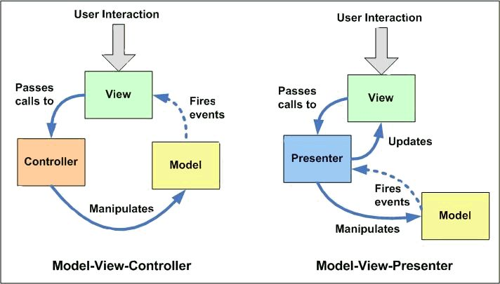

RxJava Is Not App Responsiveness

Sure you could leave your user to be exposed to all the radiation inner working hiccups of the android platform. BUT WHY DO THAT to YOUR USER?

ITS YOUR APP! SHOULD IT NOT BE YOUR USER?!

A fluid-responsive app helps turn that USER who is using YOUR APP to YOUR USER who cannot wait to get that new update or new feature you are dreaming up.

NONE OF THAT requires FUNCTIONAL-REACTIVE in the form of RxJava or Agera.

WANT TO BE THAT ANDROID DEVELOPER BAD-ASS that can get App Responsiveness without using Rxjava or Agera?  

READ MORE TO LEARN HOW

We are going to dive into all the scary monsters in android that we have to hide from the user. And hiding that scary stuff puts us on the road to an android app that is app responsive.

TWO HEADED BEASTS, Android 4x and Android 5x-7x

Targeting Android 4.x to Android7.x tends to be something of a two-headed beast as we are dealing with in-fact two different Android Platforms. Not exactly Jekyll and Hyde in severity but its close.

ANDROID4x

On android4x we have the Dalvik Virtual-Machine which means GC passes take slightly more than 4ms, in context of UIs 60 frames per second means each frame has only 1ms-to-16ms. In the UI context itself we have only one thread processing the user-interface and drawing that user-interface. And of course bitmaps do  not yet have their very own heap space. And we still have 2g/3g on Android4x as the majority of telecom providers.

ANDROID5x-7x

With android5x-7x we have a more performance enhanced android platform in the form of ART Virtual-Machine having GC passes at 2ms or less. in the UI context itself the scrolling is still in the UI thread but Material animations have been moved to a new Render Thread and Render Thread handles redrawing the UI via display-lists. And, finally bitmaps get their very own heap-space. And on Android5x-7x we start to see LTE/4g as the majority network speed.

OUR APP RESPONSIVENESS RECIPE?

So our app responsiveness recipe thus far is upon targeting both Android4x and Android5x-7x to reduce Material Animations to one or two important ones.

Seems boring, huh?

ITS THE SCROLLING, STUPID!

Our USER-INTERFACE OF OUR ANDROID APP should be as SMOOTH AS BUTTER in its scrolling for the USER as that is the first part of the UI that they interact with.

But we have some problems, well two of them in-fact.

RecyclerView's Adapter puts every task on the UI thread. Yes, binding has to be on the UI-thread as its binding to a view. BUT, why does adapting the data and creation of the view-model have to be on the UI-thread?

If its on Android4x than we have a 4ms GC pass block on the UI-thread as our view-model is created the same UI thread that happens also to handle scrolling, NOT GOOD! And adapting data via formatting results in similar 4ms timing blocks.

OUR APP RESPONSIVENESS RECIPE, now includes:

0. Convert Models to Immutables,  
   your dev peers on iOS are already targeting 80 fps for their app UIs and converting mutables to immutables helps strive towards 80 fps for the app UI(tutorial links, autovalue, in the references at end of article)

1. One or Two Material animations

2. We need some way to change user
   expectations of how fast the data is coming in order to improve the smooth scrolling on
   Android4x that is compatible with Android5x-7x. This way we
   handle both platforms that have user groups on the 3g network speeds.

WE CAN DO THIS! WE ARE ANDROID BAD-ASS DEVELOPERS!

HOW?

MOVE ADAPTING PART OFF OF THE UI THREAD AND CHANGE THE SEQUENCE ORDERING OF UI EVENTS, THAT'S HOW!

AN APP ARCHITECTURE FRAMEWORK

Both MVP and MVVM, now that Google has added a data-binding library, are somewhat better equipped to be used as app patterns for android applications. Especially those app frameworks with an adapter pattern style bias.

To solve our particular app responsiveness problem we have to adapt an adapter bias, pun intended.

You can find the soft fork of the app framework at:

its in alpha form and will shape up  into a production release in a few weeks.

The adapter types are grouped into the groups of:

1. Simple

2. Adaptable

3. Presenter

The major difference is that the SimpleAdapter is not loading one item and than doing rest of the loading, its loading data all at once. Whereas the AdaptableAdapter is loading the first item of data for display and than loading other items.

And the PresenterAdapter just is an extension of the AdaptableAdapter for full MVP app architecture patterns.

So lets look at the SimpleAdapter first.

We have the AdaptableViewModel that plugs into that:

gist4

The AdaptableViewModel holds a reference to our view-model and is a model for a single item of our list.

We have two interfaces, Taggable:

gist1

and a SimpleAdapter interface:

gist2

and we have an abstract class, SimpleBindingAdapter, to provide rest of the full methods needed for our full modified adapter:

gist3

Now our full adapter, AdaptOnDemandSimpleBindingAdapter:

gist5

So now let's step through this, a little at a time.....

The constructors set up the ExecutorService, the queue used to adapt items, and provide a way to specify a custom executorService different from the default
settings. Those items get used in out AsyncTask to create the view-model.

The secret to our method of separating adapting from binding is in the onBindViewHolder method.

gist 6

Remember, we are creating a view-model instance  in the AdaptableViewModel per each item in the list. Thus, adaptableViewModel becomes item at the position and viewModel becomes the adaptableViewModel.

At the beginning of the adaptable sequence viewModel is null and thus we look for that to start our adapting sequence. If adaptableViewModel.viewModel is not null we just return the adpatableViewModel.viewModel and if adaptableViewModel.viewModel is null we return the adapted item viewmodel. All this because its adapting occurs on the background thread via the asynctask.

Now, in our onPostExecute task we take the view-model returned and set the view-model reference in the AdaptableViewModel in case we need it again. We call a onViewModelReadyForViewHolder method in case we need to notify the RecyclerView.

Than the last step outside of the AsyncTask is to cause RecyclerView to trigger the binding.

Now let's contrast that with the strategy of displaying something first while our data is being retrieved which is the adaptable and presenter strategies in our app architecture framework.

ADAPTABLE

We have an AdaptableViewModel interface

gist7

than we have the AbstractViewModel

gist8

in which a reference to the view-model is stored.

Than we have the AdaptableAdapter interface

gist9

Than we have the abstract AdaptableBindingAdapter

gist10

and than our AdaptOnDemandAdaptableBindingAdapter full adapter

gist11

Okay, let's boil this down to what is different between Simple and Adaptable. The difference as we are now displaying a loadingview and than loading items is in the onBindViewHolder implementation.

CONCLUSION

It's not required to use RxJava or Agera to get App Responsiveness, instead we have to do what all the Android GDE's and Google Android Team members recommend which is off-load expensive tasks off of the UI-thread. And we can reach 60 fps fluid UI just by using the strategies outlined in this article.

CREDITS

I would like to thank Robert LaThanh  for the original concept and you can find his code at:

[android-mvp-framework]()

and his first exploration into it as an app example at:

[android-mvp-demos]()

REFERENCES

1. "Understanding the RenderThread" by Eugenio Marletti published on medium(https://medium.com/@workingkills/understanding%ADthe%ADrenderthread%AD4dc17bcaf979#.cc9d1ddgc)

2. "Developing for Android I Understanding the Mobile Context" by Chet Haase published on medium(https://medium.com/google%ADdevelopers/developing%ADfor%ADandroid%ADi%ADunderstanding%ADthe%A)

3. "The truth about Android and iOS UI performance" by Bob Lee published on crazsybob.org(http://blog.crazybob.org/2011/12/truth%ADabout%ADandroid%ADios%ADui%ADperformance.html)

4. "A few days ago I wrote a post trying to correct a lot of the inaccurate state..." by Dianne Hackborn published on Google+(https://plus.google.com/+DianneHackborn/posts/XAZ4CeVP6DC)

5. "Why do Android animations stutter when iOS animations are so smooth?" by Thong Nguyen published on abstractpath.com(http://www.abstractpath.com/2012/why%ADdo%ADandroid%ADanimations%ADstutter%ADwhen%ADios%ADanimations%ADare%ADso%ADsmooth/17/17)

6. "How about some Android graphics true facts?" by Dianne Hackborn published on Google+(https://plus.google.com/+DianneHackborn/posts/2FXDCz8x93s)

7. "Developing for Android I Understanding the Mobile Context" by Chet Haase published on medium(https://medium.com/google%ADdevelopers/developing%ADfor%A)
